# Slotted.ai — Data Flow Architecture

> Social scheduling app that syncs calendars, finds mutual free time, and discovers local events.

## Platform Summary

| Layer | Service |
|-------|---------|
| **Frontend Hosting** | Firebase Hosting (`slottedapp.com`) |
| **Backend** | Firebase Cloud Functions (Express, Node.js 24, us-central1) |
| **Database** | Supabase PostgreSQL (`lwqeqwjjtmcjbexoouxq.supabase.co`) |
| **Auth** | Firebase Auth (Google OAuth 2.0) |
| **Secret Storage** | Supabase Vault (encrypted OAuth tokens for Google, Outlook, Apple) |
| **Calendar Sync** | Google Calendar API v3, Apple CalDAV (iCloud), Microsoft Graph (Outlook) |
| **Event Discovery** | Ticketmaster, SeatGeek, Eventbrite, Meetup, NYC Open Data |
| **Push Notifications** | Firebase Cloud Messaging (FCM) |
| **SMS Notifications** | Telnyx (primary) + ClickSend (fallback) — meetup invites, RSVP nudges |
| **Analytics** | Firebase Analytics (lazy-loaded, `slotted_` prefixed events) |
| **Background Jobs** | Cloud Scheduler (every 30min: batch free-slot sync) + Google Calendar webhooks |

## Data Flow

```mermaid
flowchart TB
    subgraph Browser["🌐 Browser / PWA"]
        App["React + Vite SPA\nTanStack Query\nTailwind v4"]
        FCMClient["FCM Service Worker\nPush notifications"]
    end

    subgraph Firebase["🔥 Firebase"]
        Hosting["Firebase Hosting\nslotted-ai.web.app"]
        Functions["Cloud Functions (Express)\nus-central1, Node.js 24\n• /calendar/*\n• /events/*\n• /meetups/*\n• /friends/*\n• /availability/*\n• /users/*"]
        FBAuth["Firebase Auth\nGoogle OAuth 2.0"]
        FCMServer["FCM\nPush delivery"]
        Analytics["Firebase Analytics\nFunnel events"]
    end

    subgraph Supabase["☁️ Supabase"]
        DB["PostgreSQL (RLS)\n• users\n• friendships\n• availability\n• meetups + participants\n• calendar_selections\n• notifications\n• fcm_tokens\n• sms_pending_actions\n• meetup_logs\n• feedback"]
        Vault["Supabase Vault\n🔒 Encrypted OAuth tokens\n• Google access/refresh\n• Outlook access/refresh\n• Apple CalDAV creds"]
    end

    subgraph Calendars["📅 Calendar Providers"]
        GCal["Google Calendar API v3\n+ Webhooks (push sync)"]
        AppleCal["Apple CalDAV\niCloud (tsdav)"]
        OutlookCal["Microsoft Graph API\nOutlook Calendar"]
    end

    subgraph Events["🎫 Event Discovery APIs"]
        TM["Ticketmaster\nDiscovery v2"]
        SG["SeatGeek\nv2 API"]
        EB["Eventbrite\nv3 API"]
        MU["Meetup\nREST API"]
        NYC["NYC Open Data"]
    end

    subgraph SMS["📱 SMS Providers"]
        Telnyx["Telnyx\napi.telnyx.com\n(primary)"]
        ClickSend["ClickSend\nrest.clicksend.com\n(fallback)"]
    end

    App <-->|"Firebase ID token\non every request"| Functions
    App <-->|"auth state"| FBAuth
    App -->|"event tracking"| Analytics
    App <-->|"push registration"| FCMClient

    Functions <-->|"CRUD + RLS"| DB
    Functions <-->|"read/write\nOAuth tokens"| Vault
    Functions -->|"send push"| FCMServer
    Functions -->|"meetup invites\n+ RSVP nudges\n(dedup via sms_pending_actions)"| Telnyx
    Functions -.->|"fallback if\nTelnyx down"| ClickSend
    FCMServer -->|"web push"| FCMClient

    Functions <-->|"sync events\n+ webhooks"| GCal
    Functions <-->|"CalDAV\nRFC 4918"| AppleCal
    Functions <-->|"Graph API"| OutlookCal

    Functions -->|"search\n(waterfall + dedup)"| TM
    Functions -->|"fallback"| SG
    Functions -->|"social events"| EB
    Functions -->|"community"| MU
    Functions -->|"local NYC"| NYC

    GCal -->|"webhook push\nreal-time sync"| Functions

    style Browser fill:#e8f4fd,stroke:#2196F3
    style Firebase fill:#fff8e1,stroke:#FFA000
    style Supabase fill:#e8f5e9,stroke:#4CAF50
    style Calendars fill:#f3e5f5,stroke:#9C27B0
    style Events fill:#fff3e0,stroke:#FF9800
    style SMS fill:#fce4ec,stroke:#E91E63
```

## Key Data Flows

1. **Calendar Sync**: User connects Google/Apple/Outlook → OAuth tokens encrypted in Supabase Vault → cron (30min) fetches events → free/busy blocks stored in `availability` table
2. **Real-Time Sync**: Google Calendar webhook fires on event change → Cloud Function processes → availability updated
3. **Friend Overlap**: User views friend's availability → backend computes overlap from `availability` table → mutual free slots returned
4. **Meetup Creation**: User proposes meetup → stored in `meetups` + `meetup_participants` → FCM push + SMS (Telnyx) sent to invited friends → RSVP updates status → confirmed meetup auto-added to connected calendars
5. **SMS Nudges**: Backend triggers via `sms_pending_actions` (dedup table) → Telnyx primary → ClickSend fallback if `SMS_PROVIDER=clicksend` or Telnyx fails → soft-toned messages (no ❌, no "declined")
6. **Event Discovery**: User searches events via debounced autocomplete (AbortController) → backend queries Ticketmaster (primary) → SeatGeek (fallback) → results deduplicated by title+datetime → merged ticket links returned
